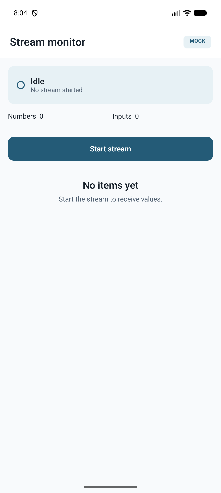
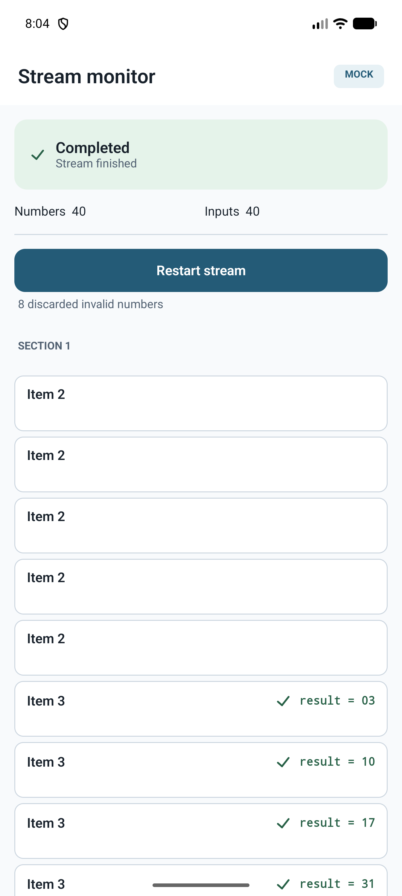

# StreamMonitor

An Android app that joins two independent value streams by index, validates and computes
results under bounded CPU work, and presents them incrementally and resiliently. The core is
a coroutine stream coordinator that pairs each number with its computation input as both
arrive, schedules only the computations that can produce a visible result, and emits
snapshots at a cadence decoupled from the arrival rate.

## Screenshots

| Idle                                | Completed run                                      |
|-------------------------------------|----------------------------------------------------|
|   |    |

The completed shot is the `happy_path` mock scenario: 40 numbers and 40 inputs received, 8
values discarded as invalid, rows grouped by section and ordered by item. `Item 2` rows carry
no result because their result bit is not set; `Item 3` rows show the computed value.

## Running it

**Requirements**

- **JDK 25 to run the build.** The Gradle daemon JVM is pinned by
  `gradle/gradle-daemon-jvm.properties` (`toolchainVersion=25`) and provisioned through the
  `foojay` resolver. This is separate from the *bytecode target*: `app` compiles to Java 11
  bytecode (`JavaVersion.VERSION_11`) and `core:domain` pins `jvmToolchain(11)`, which is what
  runs on device — not the JDK you need installed to build.
- Android SDK with `compileSdk 37`. `minSdk 26`, `targetSdk 37`.
- Nothing beyond the standard Android SDK; the Gradle wrapper handles the rest. The
  configuration cache is on by default.

**Build and test**

```bash
./gradlew build               # full build + all unit tests, every module
./gradlew test                # unit tests only, every module
./gradlew :core:domain:test   # the coordinator and parser suites alone (fast, pure JVM)
./gradlew :app:assembleDebug  # debug APK only
```

The debug APK lands at `app/build/outputs/apk/debug/app-debug.apk`.

**Choosing a data source (the switch is configuration, never a code edit)**

The source and scenario are Gradle properties baked into `BuildConfig` at build time and read
once by `StreamDataSourceConfigModule`. The default is `mock` with `happy_path`.

```bash
./gradlew :app:installDebug -PstreamDataSource=mock -PmockScenario=happy_path  # balanced, 80% valid
./gradlew :app:installDebug -PstreamDataSource=mock -PmockScenario=malformed   # nulls, out-of-range, bad items
./gradlew :app:installDebug -PstreamDataSource=mock -PmockScenario=unbalanced  # numbers finish first
./gradlew :app:installDebug -PstreamDataSource=mock -PmockScenario=large       # 20,000 + 20,000 values
```

Remote mode requires both endpoints. A blank one throws `IllegalArgumentException` naming the
offending endpoint when the data source is resolved, rather than failing silently at the first
poll.

```bash
./gradlew :app:installDebug \
  -PstreamDataSource=remote \
  -PnumbersEndpoint=https://example.test/numbers \
  -PinputsEndpoint=https://example.test/computation_input
```

**Instrumented tests.** There are none worth running: `app/src/androidTest` holds only the
generated placeholder. `./gradlew build` compiles it but the suite asserts nothing. See
*Trade-offs*.

## Requirement → Where it lives

The brief itself is not checked into this repository; the requirements below are the ones
recorded in `PLAN.md` when the work was scoped, each mapped to the code that satisfies it.

| Requirement | Where it lives |
|---|---|
| **Two endpoints polled independently**, each returning the values available at request time, possibly truncated | `pollUntilDone` in `StreamCoordinator.kt` runs one polling coroutine per endpoint; batches arrive as `Event.Batch` on a rendezvous `Channel`, so neither endpoint waits for the other. |
| **An empty array means that stream is done** | `if (values.isEmpty())` emits `Event.EndpointFinished` and stops that poller. |
| **Index `i` of numbers corresponds to index `i` of inputs**, but the streams advance at different rates | Each stream owns a cursor (`numberCursor`, `inputCursor`) incremented per received entry. `scheduleIfReady(index)` is called from *both* the number and input paths, so whichever arrives second triggers the join. |
| **Parse each value: bits 0–1 section, bits 2–6 item, bit 7 result flag** | `NumberParser.parse` — `SECTION_MASK = 0b11`, `ITEM_SHIFT = 2` / `ITEM_MASK = 0b1_1111`, `RESULT_FLAG_MASK = 1 shl 7`. |
| **Item values above 5 are invalid** | `MAX_ITEM_INDEX = 5` → `ParseResult.Invalid(ITEM_OUT_OF_RANGE)`. Exactly 48 of the 256 byte values parse as valid, pinned by a census test over the full byte domain. |
| **Handle `null` entries** | A `null` *number* is `Invalid(NULL_VALUE)` and increments the discarded count. A `null` *input* is `ResultState.Failed(MISSING_INPUT)` — a row-level failure, not a discard. The two are modelled separately on purpose. |
| **Values outside the byte range** | `Invalid(OUT_OF_BYTE_RANGE)`: the JSON carries `Int`, so `0..255` is validated in the parser rather than assumed by the type. |
| **Compute a result for values whose result bit is set**, from a 16-bit unsigned input | `ResultComputer.compute(input: UShort)` returns `input % 100` zero-padded to two characters. Inputs outside `0..65535` become `Failed(INVALID_INPUT)`. |
| **The computation is CPU-expensive** | `SIMULATED_WORK_ITERATIONS = 100_000` integer ops, explicitly marked as a cost simulation and removable without changing the returned value. It is a busy loop, not a `delay`, so it is real CPU load. |
| **Display results grouped by section, ordered by item** | Four `TreeSet<StreamRow>` (one per section) ordered by `rowComparator`; `StreamSnapshot.rows` is already sorted when the UI receives it. |
| **Show how many values were discarded** | `discardedCount` on the snapshot → `DiscardedSummary` atom, rendered through a `<plurals>` resource. |
| **Results appear incrementally as they are computed** | The coordinator emits a snapshot after every drained computation batch; the `LazyColumn` keys rows by `sourceIndex`, so a row that gains a result moves instead of being recreated. |
| **Survive endpoint failures** | `StreamEndpointException` carries retryability; transient failures retry with linear backoff, exhausted retries produce `StreamLifecycle.Failed` **without erasing rows already received**. |
| **Mock and real data sources behind one interface** | `NumbersDataSource` / `InputsDataSource` with `Remote*` and `Mock*` implementations; `StreamDataSourceModule` is the only place that chooses. No call site branches on the active source. |
| **Evidence of performance** | Measured on the `large` scenario — see *Performance*. |
| **Document AI usage** | `docs/AI_USAGE.md`. |

## Architecture

Five Gradle modules, layered so the domain stays pure and the UI stays reusable:

```
                        ┌───────┐
                        │  app  │  Activity, Hilt graph, edge-to-edge, BuildConfig switch
                        └───┬───┘
             ┌──────────────┼──────────────────────┐
             ▼              ▼                      ▼
      ┌────────────┐ ┌──────────────┐       ┌────────────┐
      │ core:data  │ │feature:stream│──────▶│  core:ui   │  Compose design system
      └─────┬──────┘ └──────┬───────┘       └────────────┘  (primitives only)
            │               │
            ▼               ▼
         ┌──────────────────────┐
         │     core:domain      │  Pure Kotlin/JVM: parser, coordinator,
         └──────────────────────┘  result computer, models (no Android)
```

Every arrow points from a module to the module it depends on.

Dependencies (from each module's `build.gradle.kts`):

| Module | Depends on |
|---|---|
| **app** | `core:data`, `core:ui`, `feature:stream` |
| **feature:stream** | `core:domain`, `core:ui` |
| **core:data** | `core:domain` |
| **core:ui** | Compose only |
| **core:domain** | Kotlin + coroutines only |

Dependency injection is wired with Hilt in `app`, `core:data` and `feature:stream`.

**Why `core:domain` is pure Kotlin (no Android).** It's a `kotlin-jvm` module, not an Android
library. The parser, the stream coordinator and the result computer have no dependency on the
Android framework, so the entire join-and-compute engine is exercised in fast local JVM tests
with **virtual time** — no emulator, no Robolectric, and a 20,000-value scenario that runs in
milliseconds instead of seconds. Keeping Android out is also what forces the clean seams
below: the coordinator receives dispatchers and a `compute` function rather than reaching for
`Dispatchers.Default` implicitly, because there is no framework to hide behind.

**Why `core:ui` does not depend on `core:domain`.** The design-system atoms (`ResultRow`,
`LifecycleBanner`, `SourceCounts`, `DiscardedSummary`, `SectionLabel`, `MockBadge`) take
primitives — `String`, `Int`, `Boolean` — never domain types. `ResultRow` receives a
pre-formatted state string and an `Int` row kind, not a `ResultState`. The design system is
self-contained and independently previewable, and translating domain state into those
primitives is the feature layer's job.

**`feature:stream` does not depend on `core:data` either.** The feature depends on domain
contracts only — it receives a `StreamCoordinatorFactory` and never learns whether the values
came from Ktor or from a mock scenario. `app` is the single module that sees both sides and
binds them together.

**Route/Screen pattern.** `StreamRoute` is the only composable that knows about Hilt and the
ViewModel: it collects state with `collectAsStateWithLifecycle` and forwards intents.
`StreamScreen` is stateless — it renders a `StreamUiState` and emits `StreamIntent`s through a
callback, with no Hilt graph required.

## Key decisions

### Lazy computation

**Problem.** A number and its input arrive independently, and only numbers with the result bit
set ever display a value. Computing eagerly on every input that arrives is simpler — you don't
have to coordinate anything — but it burns CPU on rows that will never show the result, and
under the simulated 100k-iteration cost that waste is measurable.

**Choice.** Compute lazily. `scheduleIfReady(index)` schedules work only when the number at
that index is known, valid, **and** has its result bit set, and a usable input is present. It
is called from both arrival paths, so the trigger fires whichever value lands second.

**Cost.** Latency when the input arrives well before its number: the work cannot start until
the number proves it is needed. The alternative — compute eagerly and discard — trades CPU for
that latency. With the CPU cost simulated at 100k iterations per computation, the trade is
worth it; with a trivially cheap computation it would not be.

### Bounded parallelism, and why four

**Problem.** The obvious implementation launches a coroutine per incoming value. That works
until the input is large, at which point 20,000 concurrent computations compete for a handful
of cores and the dispatcher becomes the bottleneck.

**Choice.** `Dispatchers.Default.limitedParallelism(4)`, with the bound as a named constant
(`MAX_COMPUTATION_PARALLELISM`). The coordinator does not keep persistent workers or a work
channel: it drains its pending queue in batches of at most four `async` computations and
`awaitAll`s each batch. Four is a deliberately small mobile budget — enough to use the little
cores of a typical phone without starving the rest of the app, and small enough that the
dispatcher never becomes the contended resource.

**Cost.** A hard ceiling on throughput: on a device with many cores the computation stage will
not scale past four. The bound is one constant, so raising it is a one-line change — but it
should be a measured one, not a guess.

### Emission decoupled from arrival

**Problem.** Batches can arrive faster than the UI can render. One emission per received value
would make the snapshot rate a function of network speed, and the recomposition cost would
track the stream rate rather than the display rate.

**Choice.** The snapshot flow ends with `.flowOn(coordinatorDispatcher).conflate()`. Conflation
drops intermediate snapshots the collector never had time to read, so the UI always renders the
latest state and the emission cadence is bounded by how fast the UI consumes, not by how fast
values arrive.

**Cost.** Intermediate states are genuinely lost — you cannot use this flow to animate every
individual row transition, because some of them never reach the collector. For a monitor
showing current state that is exactly the right trade; for an event log it would be wrong.

### Stable identity separate from sort order

**Problem.** A row's sort position changes when its result arrives — that is the entire point
of the screen. If identity and position are the same thing, a computed result destroys the row
and creates a new one: the `LazyColumn` recycles it as a fresh item, and it flickers rather
than moves.

**Choice.** `StreamRow.sourceIndex` is the identity and never changes; the sort key is
`(itemIndex, result.sortOrder, sourceIndex)`. `updateRow` removes the row from its section's
`TreeSet`, copies it with the new state, and reinserts it — same identity, new position. The
`LazyColumn` keys on `sourceIndex`. Because `sourceIndex` is the final tie-breaker, the
ordering is **total**: no two rows ever compare equal, so the order is deterministic even among
rows sharing an item and a state.

**Cost.** Two concepts to keep straight where one would compile, plus a `TreeSet` per section
rather than a flat list. In exchange, re-sorting is scoped to the section that changed instead
of the whole dataset.

### Serialized restart

**Problem.** Start, Restart and Retry all begin a new run. Tapping twice quickly could leave
two coordinators polling the same sources and interleaving their snapshots into one UI state.

**Choice.** A new run cancels the previous `Job` with `cancelAndJoin()` **and** takes a
`Mutex` before it resets state and builds its coordinator.

**Why the mutex is not redundant.** `cancelAndJoin()` on the previous job looks sufficient, but
it isn't: a *third* rapid intent can cancel a run that is still awaiting its own predecessor.
That cancelled run never reaches its cleanup, so the new run can start resetting state while
the older one is still tearing down. The mutex is released only after the flow — and therefore
its polling and computation coroutines — has fully unwound, which is the property `cancelAndJoin`
alone does not give you.

**Cost.** A restart is not instantaneous; it waits for the previous run to release the lock.
That is the correct trade for a monitor where two runs writing one state is a correctness bug.

### Rows retained on failure, counters reset on a new run

**Problem.** When retries are exhausted mid-stream, blanking the list throws away everything
already received — the worst possible response to a network error. But keeping the *counters*
from the failed run is equally wrong: they describe a stream the user is no longer watching.

**Choice.** The two are treated differently. `startingNewRun()` always resets all three
counters to zero, and keeps rows only when the previous lifecycle was `Failed`. Those cached
rows stay visible while the retry is `Streaming` and has produced no rows of its own; the first
real row of the new run replaces them. A Restart after a clean `Completed` run drops its rows
with its counters, because there is nothing worth preserving.

**Cost.** For a moment after a retry begins, the screen mixes new counters with old rows. The
alternative — blanking everything — is worse, and the mixed state is short-lived and honestly
labelled by the lifecycle banner.

### One interface for remote and mock, switched by configuration

**Problem.** A demo that needs a live backend can't be run by a reviewer, and mock data that
lives behind `if (BuildConfig.DEBUG)` branches scattered through the implementation is a second
codebase that silently rots.

**Choice.** `NumbersDataSource` / `InputsDataSource` are plain interfaces with remote and mock
implementations. `StreamDataSourceModule` is the single switch point, driven by Gradle
properties baked into `BuildConfig`. No consumer branches on source type — `feature:stream`
cannot, because it doesn't depend on `core:data` at all. Mock scenarios are *data*
(`MockScenarioData`), not branches.

**Cost.** Switching scenarios is a rebuild rather than a runtime toggle; `StreamDataSourceConfig`
is an immutable `@Singleton`. A runtime selector would need a mutable holder and a single-slot
cache instead of the current accumulating `ConcurrentHashMap`.

**The mock ratios are deliberate.** Random bytes are only ~19% valid, so a generator that
ignores this produces an almost-empty list and a demo that looks broken. `happy_path` and
`large` are built to be exactly 80% valid; `malformed` is 50%. Every generator states its
ratio, and tests assert it.

### One shared `HttpClient` configuration for production and tests

**Problem.** The tests built their own Ktor client with `expectSuccess = true` and
`ignoreUnknownKeys = true` copied from the Hilt provider. Every retry-classification assertion
therefore pinned the *test's* configuration, not the app's. Removing `expectSuccess` from
production would have made 5xx bodies flow into the deserializer and be misclassified as
terminal decoding failures — ending the stream on the first transient server error — with the
entire suite still green.

**Choice.** `streamHttpClient(engine)` is the single definition of that configuration. Hilt
calls it with `OkHttp`; the tests call it with `MockEngine`. Only the engine differs. Two tests
assert the behaviour each setting produces, and both were mutation-checked: deleting
`expectSuccess` fails five tests, flipping `ignoreUnknownKeys` fails one.

**Cost.** One more indirection between Hilt and Ktor. Trivial next to a test suite that was
measuring itself.

### The JSON keys are the brief's, not a convenient generic shape

**Problem.** The first implementation modelled both endpoints with one `{"values": [...]}` DTO.
It is simpler — a single shared type, one deserializer — and it was wrong: the brief specifies
two different keys.

**Choice.** Two `@Serializable` types, `NumbersPayload` with `@SerialName("numbers")` and
`InputsPayload` with `@SerialName("computation_input")`. They deserialize to the same
`List<Int?>`, so the contract at the data/domain boundary is unchanged; only the wire format
differs, which is exactly where the difference actually lives.

**Cost.** Two DTOs where a generic one would compile, and a third endpoint would mean a third
type. Spec fidelity beats internal tidiness at a system boundary you do not control.

### Error classification belongs to `core:data`

**Problem.** Ktor's raw 5xx exceptions were escaping untranslated while the coordinator's retry
logic only recognised `IOException` and an already-translated exception, so a 5xx would have
failed permanently on its first attempt. The knowledge of what is retryable was split across
two layers, and neither owned it.

**Choice.** `fetchPayload` in `core:data` translates **every** transport and payload failure
into a `StreamEndpointException` carrying its own retryability: 5xx, 408, 429 and connection
timeouts are retryable; other 4xx and all decoding failures are terminal. `CancellationException`
is rethrown before the generic catch so cancellation is never swallowed. The domain never sees a
transport type.

**Cost.** The data layer now owns a policy decision that looks like it could live in the domain.
It can't: only the layer that knows about HTTP can classify HTTP.

## Assumptions

The brief states that ambiguity is intentional. These are the readings I committed to:

- **Item values 6–31 are invalid.** Bits 2–6 hold five bits (0–31) but only six item titles
  exist, so anything above 5 is discarded rather than clamped.
- **Sort order within a section** is item, then state, then source index, with the state order
  `NotNeeded`, `Pending`, `Ready`, `Failed`. `NotNeeded` precedes `Ready` to match the brief's
  "Item 4" before "Item 4 result=03" example; `Pending` sits before computed results because it
  is unresolved, and `Failed` is last as the terminal state. Two `Ready` rows tie on state and
  are separated by source index, never by their displayed value.
- **Retry restarts, it does not resume.** Each run builds a fresh coordinator over freshly
  resolved data sources, so a mock source never inherits the previous run's cursor.
- **Index pairing is by cumulative receive order per stream**, not by any identifier inside the
  payload — the *n*-th value received from numbers pairs with the *n*-th received from inputs.
- **Inputs are 16-bit unsigned.** Anything outside `0..65535` is `Failed(INVALID_INPUT)`, which
  is distinct from a missing input.
- **A stream is complete only when both endpoints have returned empty and every scheduled
  computation has settled**, asserted with `check(pendingComputations.isEmpty())` before the
  lifecycle moves to `Completed`.
- **The remote JSON contract was initially wrong and was corrected.** The first implementation
  assumed a single generic `{"values": [...]}` payload shared by both endpoints. That was an
  inferred shape, not the specified one: the brief names two distinct keys, `numbers` and
  `computation_input`. It is recorded here as well as in *Key decisions* because it was an
  assumption I made rather than a trade-off I chose, and it was caught in review rather than
  at the point of writing.

## Testing

71 tests across the three modules that carry logic, layered to match them. `core:domain` is
the heavily-tested part and runs entirely on the JVM. (`app` also holds the generated
`ExampleUnitTest` asserting `2 + 2 == 4`; it is not counted here.)

- **Domain (`core:domain`, 31 tests).** The coordinator is tested with **virtual time** —
  `runTest`, `TestDispatcher`, `advanceTimeBy` — with **zero real `delay` and zero
  `Thread.sleep`**; the backoff delay is an injected `suspend (Long) -> Unit`, and the
  `compute` function is injectable so tests can make it fail or hang deterministically.
  Coverage includes both arrival orders for an index, an input landing on an invalid number,
  unbalanced streams, `null` inputs, out-of-range inputs, rows moving on completion under a
  stable identity, a 500-row computation batch not deadlocking the four workers, one failed
  computation not blocking its siblings, cancellation stopping outstanding polling, retry with
  recovery, exhausted retries retaining rows, and completion only after both streams end.
  `NumberParser` is tested with **explicit byte vectors and their expected decoding** (4, 12,
  16, 21, 131, 136, 150 valid; 24 and 255 rejected for item range), plus a census over all 256
  byte values asserting exactly 48 valid and 208 invalid — the ratio that makes random-byte
  mock data almost entirely useless.

- **Data (`core:data`, 32 tests).** The remote sources are tested through `MockEngine` against
  the **production client factory**, covering both endpoint keys, every retry classification,
  a syntactically corrupt body, and a type-mismatched field. Mock scenarios are asserted for
  their stated valid/invalid ratios, and `MockScenarioStreamIntegrationTest` runs each scenario
  end to end through the real coordinator.

- **Feature (`feature:stream`, 8 tests).** `StreamSnapshotMapper` is tested for lifecycle
  mapping, section grouping across all four row states, and the retention rules: a restart
  clearing rows and counters, a retry keeping rows but resetting counters, cached rows
  surviving until the new run produces its own.

**What actually pins the guarantees.** A test count is not evidence, so the tests guarding
non-obvious properties were mutation-checked — break the implementation, confirm the test
fails, restore it:

- **The `malformed` scenario** was audited with an **independent oracle** — a from-scratch
  reimplementation of the bit rules, deliberately not reusing `NumberParser`. That is what
  caught that the scenario did not exercise what it advertised: its malformed inputs happened
  to sit on indices whose *numbers* were already invalid, so those inputs were discarded before
  they could fail a row. The scenario compiled, ran, and matched its documented ratio while
  demonstrating neither of the two row-failure paths it was named for. It was fixed by moving
  the inputs onto valid result-bearing numbers, and a test now pins that alignment so it cannot
  silently drift again.
- **Lazy computation** is guarded by `number without result bit never schedules computation`.
  Make the coordinator schedule eagerly and it fails — which matters because eager scheduling is
  otherwise invisible: the displayed output is identical, only the CPU cost differs.
- **Cursor freshness** is guarded by tests that call the **production** Hilt provider with
  counting providers. An earlier version built its own factory lambda inline and passed even
  when the real code hoisted endpoint resolution out of `create()` — it was measuring its own
  mock. Rewritten against the real provider, the same mutation fails.
- **The shared HTTP configuration**, as described above: removing `expectSuccess` fails five
  tests, disabling `ignoreUnknownKeys` fails one.

**Not covered.** There are no Compose UI tests and no screenshot tests; the UI was verified by
running each scenario on an emulator. See *Trade-offs*.

## Performance

Measured on the `large` mock scenario — 20,000 numbers plus 20,000 inputs, 40,000 values total
— running on an Android emulator (Pixel 9 Pro XL, API 36), debug build, with the CPU-cost
simulation at its full 100,000 iterations per computation.

| Metric | Value |
|---|---|
| Mean end-to-end time to `Completed` | **2.650822252 s** |
| Throughput | **≈15,089 values/s** |
| Snapshot mapper, cumulative | 1.862560118 s (**70.26%** of the run) |

The number worth acting on is the last one: the dominant cost is not the join, the parsing or
the bounded computation — it is `StreamSnapshotMapper` rebuilding every visible UI row on every
surviving snapshot.

**An optimisation that was measured and reverted.** A per-`sourceIndex` reference cache was
implemented to reuse unchanged row objects. It was functionally correct and verified with
dedicated identity tests — and it made the metric **worse**: mapper time rose to 2.222957407 s
(82.10%) of a 2.707627418 s mean, about 57 ms slower end to end. The cache still traversed
every row and added map and list bookkeeping on top of the traversal it was meant to avoid. It
was reverted because the number went the wrong way, not because it looked inelegant.

Reusing row references cannot help while the mapper still walks the full snapshot. The next
attempt has to change the shape of the problem: expose row deltas from the coordinator, or
bound the UI mapping cadence, so the mapper stops doing O(rows) work per emission.

## Trade-offs and what I'd do next

- **The mapper is the known bottleneck and is still unoptimised.** 70.26% of the large-scenario
  run, with one documented failed attempt. The correct fix is a delta-based snapshot contract
  (or sampling before mapping), not a smarter cache — that much has been measured, not guessed.
- **No Compose UI tests, no screenshot tests.** `app/src/androidTest` holds only the generated
  placeholder. The screen is already stateless and takes a `StreamUiState`, so it is trivially
  testable with `createComposeRule`; the atoms in `core:ui` take primitives and would suit
  Paparazzi goldens well. This is the largest real gap in the test strategy, and the reason the
  *Testing* section names it explicitly rather than counting the placeholder.
- **Light theme only.** `docs/design_spec.md` defines a full dark palette; `StreamMonitorTheme`
  implements `lightColorScheme` alone. Wiring the dark scheme is mechanical — the tokens already
  exist — it simply was not in scope for the day.
- **No runtime scenario selector.** Switching mock scenarios is a rebuild. A bottom-sheet
  selector was scoped and cut; it would need `StreamDataSourceConfig` to stop being an immutable
  `@Singleton`, and `MockScenarios`' cache to become single-slot instead of retaining every
  visited scenario for the process lifetime (acceptable at four scenarios, not as a pattern).
- **Fixed four-way parallelism.** A sensible mobile default, but it ignores the actual core
  count. `Runtime.availableProcessors()`-derived sizing would be better, and should be
  introduced with a measurement rather than as a refactor.
- **Test configuration is duplicated across modules.** The JUnit 5 / Kotest wiring is repeated
  in each `build.gradle.kts`. At this size it is tolerable; past a few more modules I would
  extract convention plugins into a `build-logic` included build.
- **No offline caching, analytics, or crash reporting.** Deliberately out of scope: none of them
  are in the requirements, and each would add a dependency this project does not need.
